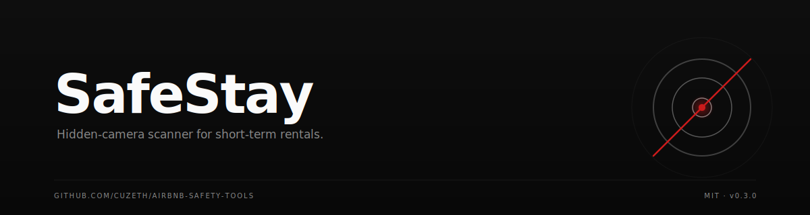

<p align="center">
  
</p>

<p align="center">
  <a href="https://github.com/Cuzeth/airbnb-safety-tools/releases"></a>
  
  
  
</p>

> ## ⚠️ LEGAL NOTICE — READ BEFORE USING
>
> SafeStay is provided **"AS IS"**, with **NO WARRANTY** and **NO LIABILITY** of any kind. It is **NOT legal advice**. The author **does not condone, encourage, or recommend** its use against any network, device, host, platform, or person.
>
> Network scanning, port scanning, and the techniques used by this tool may be **illegal, regulated, or restricted** under the laws of your jurisdiction and the terms of service of the network you are connected to. **You alone are responsible** for confirming that you have lawful authorization to scan, before you scan.
>
> Nothing in this software, this README, the in-app guide, or the exported report is legal advice. If you believe a crime has been committed, contact local law enforcement and a licensed attorney — not this tool.
>
> SafeStay is **not affiliated with** Airbnb, Vrbo, any hotel chain, or any camera vendor. Vendor names appear as technical references only.
>
> By downloading, installing, building, or running this software you agree to the full **[DISCLAIMER.md](./DISCLAIMER.md)** and **[LICENSE](./LICENSE)**. If you do not agree, do not use this software.

---

A terminal-based hidden-camera scanner for Airbnbs, hotels, and short-term rentals.

It scans the local WiFi network, identifies devices by manufacturer, probes camera-specific ports, and flags suspicious devices with risk levels. It also ships an in-app physical-check guide for the cameras a network scan **cannot** detect (4G/SIM cameras, SD-card recorders, devices on a separate VLAN), plus a step-by-step "what to do if you found something" script you can read from your phone.

## Install

### One-liner (macOS & Linux)

```bash
curl -fsSL https://raw.githubusercontent.com/Cuzeth/airbnb-safety-tools/main/install.sh | bash
```

This downloads the right binary for your platform into `~/.local/bin`, never asks for sudo, and prints exactly what to do next. Always inspect a piped-curl install script before running it — you can read this one [here](./install.sh).

### Manual download

Grab the latest binary for your platform from [Releases](https://github.com/Cuzeth/airbnb-safety-tools/releases):

```bash
# macOS (Apple Silicon)
curl -L -o safestay https://github.com/Cuzeth/airbnb-safety-tools/releases/latest/download/safestay-darwin-arm64
chmod +x safestay

# macOS (Intel)
curl -L -o safestay https://github.com/Cuzeth/airbnb-safety-tools/releases/latest/download/safestay-darwin-amd64
chmod +x safestay

# Linux (x86_64)
curl -L -o safestay https://github.com/Cuzeth/airbnb-safety-tools/releases/latest/download/safestay-linux-amd64
chmod +x safestay
```

### Build from source

Requires Go 1.26+.

```bash
git clone https://github.com/Cuzeth/airbnb-safety-tools.git
cd airbnb-safety-tools
make build
```

## Can't or don't want to use a terminal?

The network scan is one detection method, not the only one. If you can't install the tool right now, do the 60-second physical sweep instead — it catches a different class of threat and you can do it from your phone:

1. **Look at smoke detectors, alarm clocks, USB chargers, and air purifiers** near the bed and shower. Check for tiny pinhole lenses or odd placement angles.
2. **Sweep the room with your phone flashlight in the dark.** Camera lenses reflect a sharp, repeatable glint.
3. **Open your phone's front-facing camera** (not the rear — most rear cameras filter IR) and point it at suspicious objects with the lights off. IR night-vision LEDs show up as faint purple/white dots that your eye can't see.
4. **Look for unusual extra power cables or antennas** — those can indicate 4G/LTE cameras that bypass WiFi entirely.

If you find something, **do not confront the host**. Document it with photos, call local police first for a report number, then report to Airbnb's Resolution Center within 72 hours: <https://www.airbnb.com/help/article/3061>. (This is general information, not legal advice — see DISCLAIMER.md.)

The same guidance is built into the tool — press `?` at any time.

## Usage

For best results, run with `sudo` (enables ARP scanning, which finds more devices):

```bash
sudo safestay
```

Without sudo (uses unprivileged probing — slower, finds fewer devices):

```bash
safestay
```

Print the full legal disclaimer:

```bash
safestay --disclaimer
```

### Controls

| Key | Action |
|-----|--------|
| `s` | Start network scan |
| `e` | Export an HTML report (includes the physical-check guide) |
| `o` | Open selected device's web interface in browser |
| `1`–`9` | Select a port by number |
| `?` | Open the safety guide — physical check + what to do if you found something |
| `Esc` | Close the safety guide |
| `Tab` | Switch focus between device list and port detail panel |
| `j`/`k` or arrows | Navigate up/down |
| `PgUp`/`PgDn` | Scroll by page |
| `g`/`G` | Jump to top/bottom |
| `q` | Quit |

## How the network scan works

1. **Network discovery** — ARP scan (sudo) or unprivileged probing finds devices on the local /24 subnet.
2. **Reliability assessment** — If only your own device and the router show up, SafeStay assumes the network is using AP/client isolation and warns you that the scan results below are not meaningful on their own.
3. **Vendor lookup** — Identifies manufacturers from a 150+ MAC OUI database plus a fallback vendor list.
4. **Port scanning** — Probes 25+ camera-specific ports (RTSP, ONVIF, vendor SDKs, Tuya P2P, MQTT-TLS, debug backdoors).
5. **Risk assessment** — Combines vendor + open-port pattern into a risk level. The model is intentionally biased toward false positives for **unknown** vendors that respond on camera ports — that's the modern hostile-host profile (unbranded Tuya/ESP32 modules with random MACs).
6. **Browser integration** — Press `o` on any flagged device to open its admin panel.
7. **Reporting** — Press `e` for a self-contained HTML report that includes the device list, the physical-check guide, the "what to do if you found something" script, and the legal notice. The headline card is screenshot-friendly.

## What this tool CANNOT see

A clean network scan is not a guarantee. Pair every scan with the physical check (press `?`):

- **4G/LTE cameras** carry their own SIM and bypass the host network entirely
- **AP / client isolation** hides every other device on the network from any scanner
- **SD-card-only recorders** never go online — they cannot be detected over the network
- **Modern unbranded cameras** run stock Tuya/ESP32/Anyka firmware with random MACs that don't appear in any vendor database
- **Cameras over Bluetooth, Zigbee, or proprietary RF** are out of scope

## Ports scanned

| Port | Protocol | Description |
|------|----------|-------------|
| 554 | RTSP | Standard video streaming (all IP cameras) |
| 8554, 10554 | RTSP-Alt | Alternate RTSP — common on cheap WIFICAM-type hidden cameras |
| 1935 | RTMP | Live video streaming |
| 37777 / 37778 | Dahua-TCP/UDP | Dahua and Lorex camera control / video data |
| 8000, 8200 | Hikvision-SDK | Hikvision iVMS management |
| 6667 | Tuya-Discovery | Tuya Smart device discovery (unbranded cameras) |
| 6668, 6669 | Tuya/Wyze-P2P | Tuya local control and Wyze TUTK P2P |
| 8883 | MQTT-TLS | Cloud channel for Tuya / Smart Life / ESP32 devices |
| 32100 | CS2/PPPP | Primary port for LookCam / V380 / VRCAM hidden spy cameras |
| 8600 | TUTK-P2P | ThroughTek Kalay P2P relay (50M+ IoT devices) |
| 34567 | XMEye | Budget IP camera protocol |
| 9527 | XM-Console | Xiongmai debug backdoor |
| 23 | Telnet | Debug/backdoor on cheap cameras |
| 80, 81, 443, 8080, 8443, 8899 | HTTP(S) | Camera web admin panels |
| 5000, 5001 | NAS / Surveillance | Synology Surveillance Station |
| 3478 | STUN/TURN | WebRTC NAT traversal for cloud cameras |
| 2000, 3702 | ONVIF / WS-Discovery | Camera network discovery |

## Known camera brands detected

**Via MAC OUI:** Hikvision (81 prefixes), Dahua (27), Ring (12), Wyze (6), Arlo (6), Amcrest (4), Axis, Foscam, Reolink, Vivotek, Uniview, Hanwha/Wisenet, FLIR, Xiongmai/XMEye, Ubiquiti/UniFi, TP-Link/Tapo, Nest.

**Via vendor-name matching:** all the above plus Lorex, Swann, Eufy/Anker, Jovision, Tuya, Shelly, Espressif, Anyka, Ingenic, Goke.

Vendor names are listed strictly as technical references — they are not accusations, claims, or recommendations. Major consumer brands (Ring, Nest, Wyze, Arlo, Eufy, Tapo) are still flagged HIGH so guests know they exist, with a note that Airbnb requires hosts to disclose every camera in the listing.

## Reporting issues / contributing

Bug reports and detection-pattern contributions are welcome at <https://github.com/Cuzeth/airbnb-safety-tools/issues>.

## License & Disclaimer

[MIT License](./LICENSE) — see [DISCLAIMER.md](./DISCLAIMER.md) for the full legal notice. The short version: **AS IS, NO WARRANTY, NO LIABILITY. Not legal advice. Use at your own risk. Authorization is your responsibility. If unsure, do not run it.**
